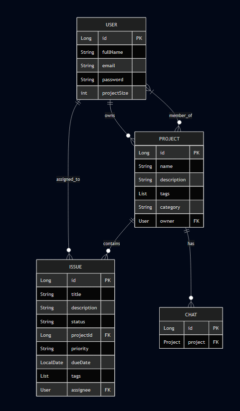

# Database Design Documentation

## Overview
This document outlines the comprehensive database design for the Project Management System. The system uses Oracle as the relational database with JPA/Hibernate for object-relational mapping.

## Entity Relationship Diagram


## Detailed Entity Specifications

### 1. User Entity (`app_user`)
#### Attributes
| Field | Type | Constraints | Description |
|-------|------|-------------|-------------|
| id | Long | PK, Auto Generated | Unique identifier |
| fullName | String | Not Null | User's full name |
| email | String | Unique, Not Null | User's email address |
| password | String | Not Null | Encrypted password |
| projectSize | Integer | Default: 0 | Number of projects owned |

#### Relationships
- **Owns Projects**: One-to-Many with Project (as owner)
  - Cascade: None
  - Fetch: Lazy
- **Member of Projects**: Many-to-Many with Project (as team member)
  - Join Table: user_project
  - Cascade: None
- **Assigned Issues**: One-to-Many with Issue
  - Mapped By: assignee
  - Cascade: ALL

### 2. Project Entity (`project`)
#### Attributes
| Field | Type | Constraints | Description |
|-------|------|-------------|-------------|
| id | Long | PK, Auto Generated | Unique identifier |
| name | String | Not Null | Project name |
| description | String | - | Project description |
| tags | List<String> | @ElementCollection | Project tags |
| category | String | - | Project category |

#### Relationships
- **Owner**: Many-to-One with User
  - Join Column: owner_id
  - Not Null
- **Team Members**: Many-to-Many with User
  - Join Table: project_team
  - Cascade: ALL
- **Issues**: One-to-Many with Issue
  - Mapped By: project
  - Cascade: ALL
- **Chats**: One-to-Many with Chat
  - Cascade: ALL

### 3. Issue Entity (`issue`)
#### Attributes
| Field | Type | Constraints | Description |
|-------|------|-------------|-------------|
| id | Long | PK, Auto Generated | Unique identifier |
| title | String | Not Null | Issue title |
| description | String | - | Issue description |
| status | String | Not Null | Current status |
| projectID | Long | FK | Associated project |
| priority | String | - | Issue priority |
| dueDate | LocalDate | - | Deadline |
| tags | List<String> | @ElementCollection | Issue tags |

#### Relationships
- **Assignee**: Many-to-One with User
  - Join Column: assignee_id
  - Nullable
- **Project**: Many-to-One with Project
  - Join Column: project_id
  - Not Null

### 4. Chat Entity (`chat`)
#### Attributes
| Field | Type | Constraints | Description |
|-------|------|-------------|-------------|
| id | Long | PK, Auto Generated | Unique identifier |

#### Relationships
- **Project**: Many-to-One with Project
  - Join Column: project_id
  - Not Null

## Database Indices
```sql
-- User email index for quick lookup
CREATE INDEX idx_user_email ON app_user(email);

-- Project name index for search
CREATE INDEX idx_project_name ON project(name);

-- Issue status index for filtering
CREATE INDEX idx_issue_status ON issue(status);

-- Issue due date index for deadline tracking
CREATE INDEX idx_issue_due_date ON issue(due_date);
```

## Data Integrity Rules
1. **Cascading Deletes**:
   - When a Project is deleted, all associated Issues and Chats are deleted
   - When a User is deleted, assigned Issues become unassigned

2. **Unique Constraints**:
   - User email must be unique
   - Project name within an owner's projects should be unique

3. **Not Null Constraints**:
   - User: fullName, email, password
   - Project: name, owner
   - Issue: title, status, project

## Repository Layer Implementation
### UserRepository
```java
public interface UserRepository extends JpaRepository<User, Long> {
    User findByEmail(String email);
}
```

### ProjectRepository
```java
public interface ProjectRepository extends JpaRepository<Project, Long> {
    List<Project> findByOwner(User user);
    List<Project> findByNameContainingAndTeamContains(String partialName, User user);
    List<Project> findByTeamContainingOrOwner(User user, User owner);
}
```

### IssueRepository
```java
public interface IssueRepository extends JpaRepository<Issue, Long> {
    List<Issue> findByProjectId(Long id);
}
```

## Database Configuration
```properties
# Database Connection
spring.datasource.url=jdbc:oracle:thin:@//localhost:1521/xe
spring.datasource.username=system
spring.datasource.driver-class-name=oracle.jdbc.OracleDriver

# JPA/Hibernate
spring.jpa.hibernate.ddl-auto=validate
spring.jpa.show-sql=true
spring.jpa.properties.hibernate.format_sql=true

# Connection Pool
spring.datasource.hikari.maximum-pool-size=10
spring.datasource.hikari.minimum-idle=5
spring.datasource.hikari.idle-timeout=300000
```