# System Design Documentation

## Architecture Overview
This Project Management System follows a layered architecture pattern implemented using Spring Boot framework.

## System Architecture Diagram
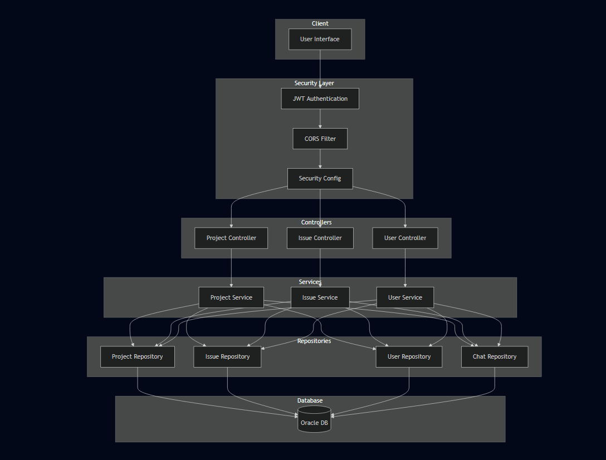

## Technology Stack
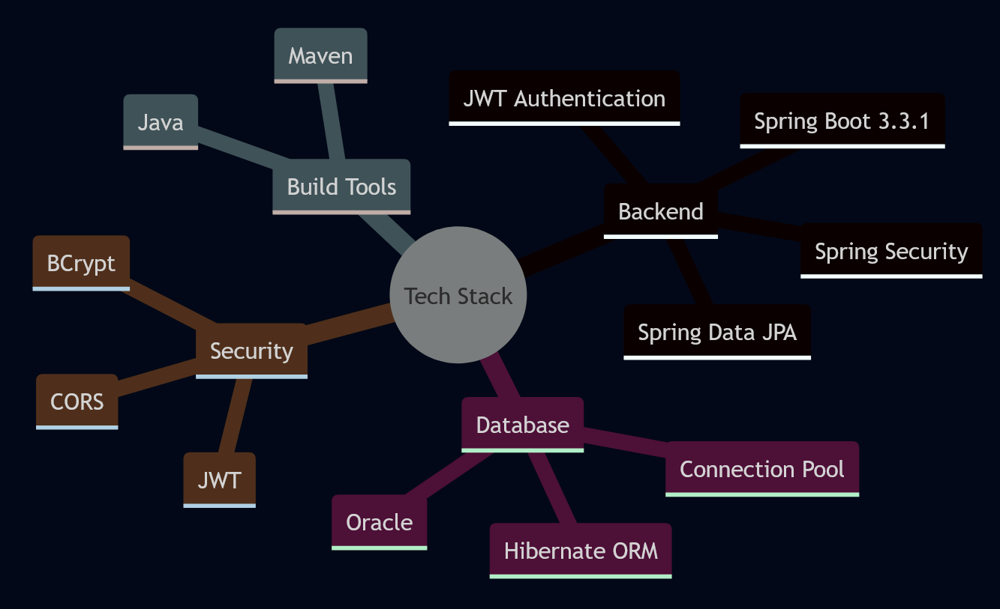

## Component Details

### 1. Security Layer
#### Authentication Flow
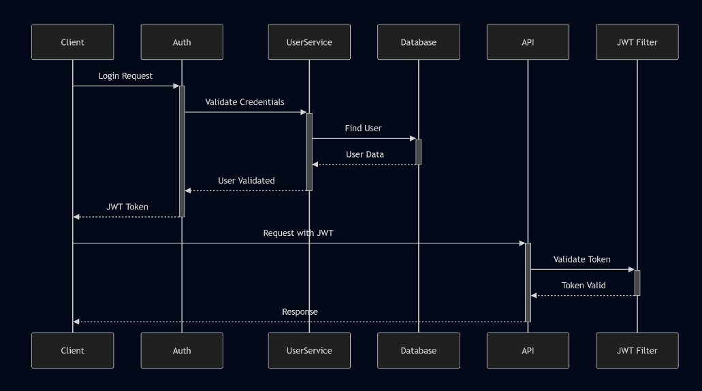

#### Security Configuration
- Protected endpoints under `/api/**`
- Stateless session management
- CORS configuration for development endpoints
- BCrypt password encryption

### 2. Controller Layer
#### API Endpoints Structure
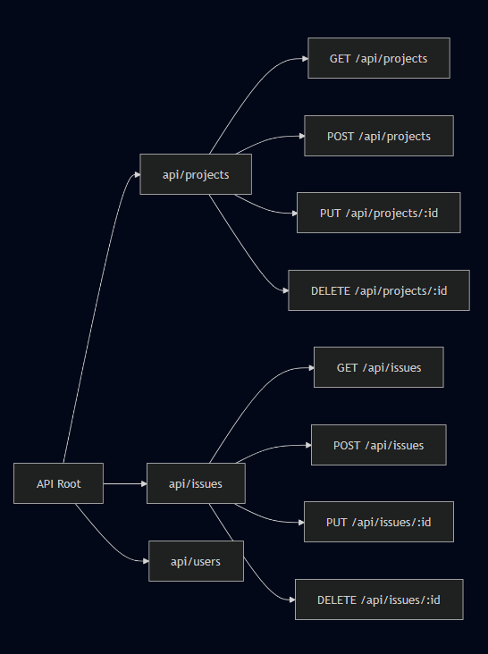

### 3. Service Layer
#### Core Services Interaction
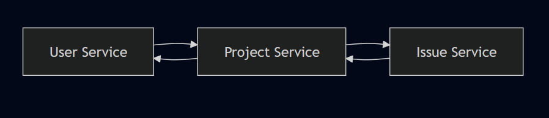

### 4. Repository Layer
#### Data Access Pattern
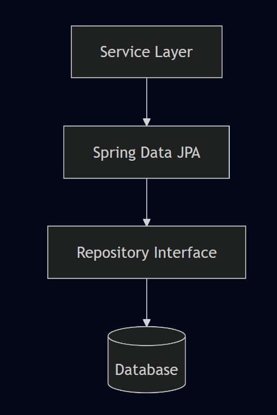

## Key Features Implementation

### 1. Project Management
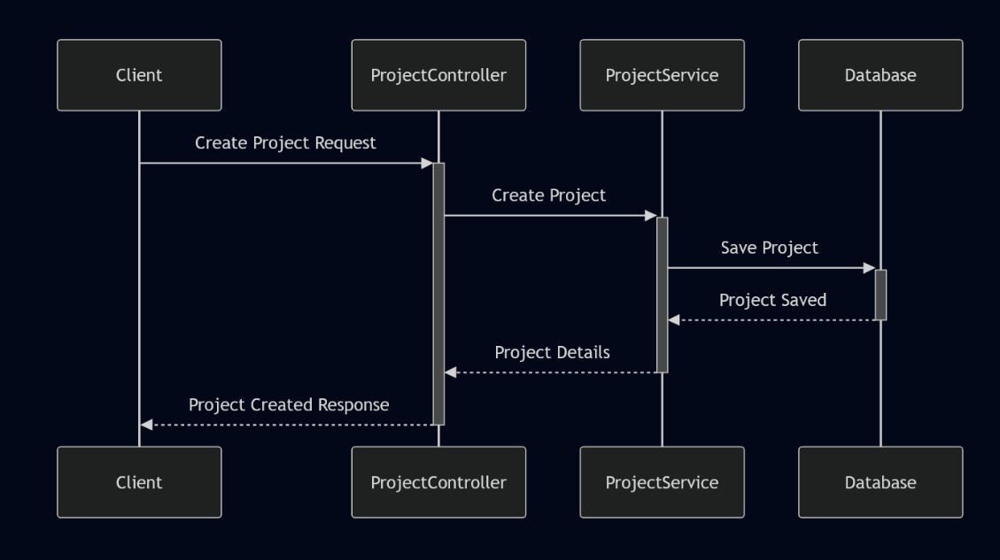

### 2. Issue Tracking
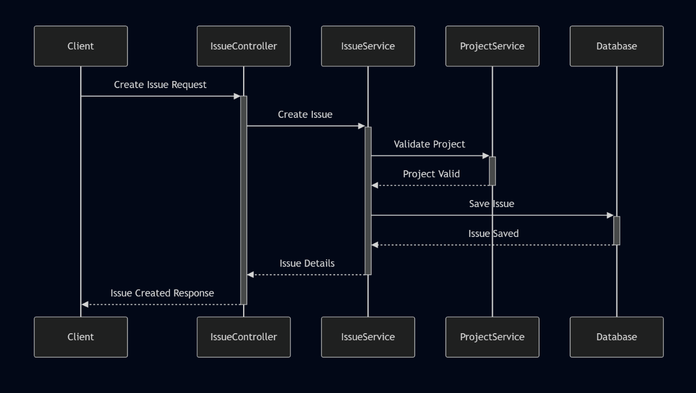

## Security Measures

### Authentication Flow
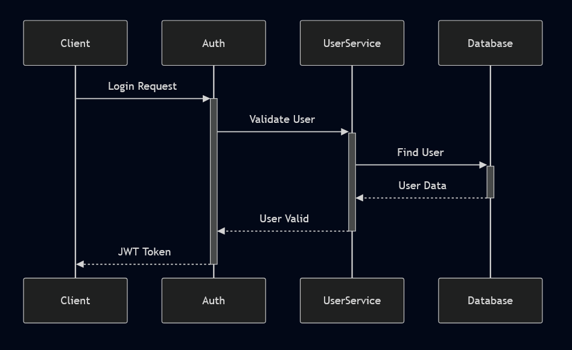

## Configuration Management

### Application Properties Structure
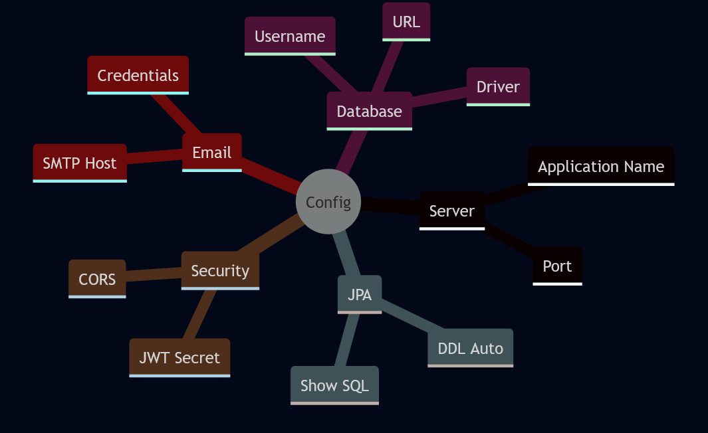

## Error Handling

### Global Exception Handling
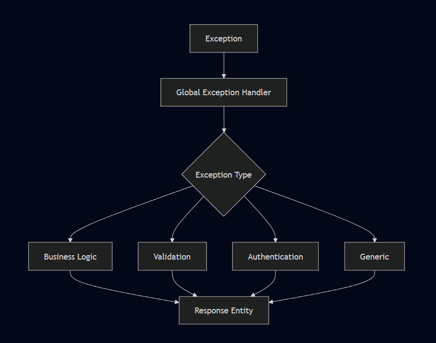

## Future Enhancements

### Planned Features
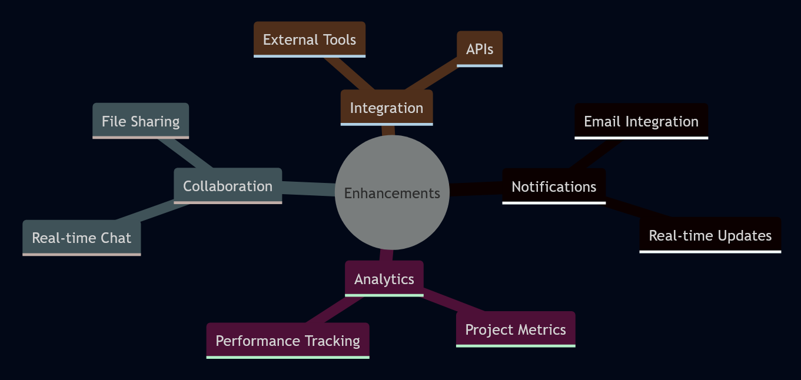