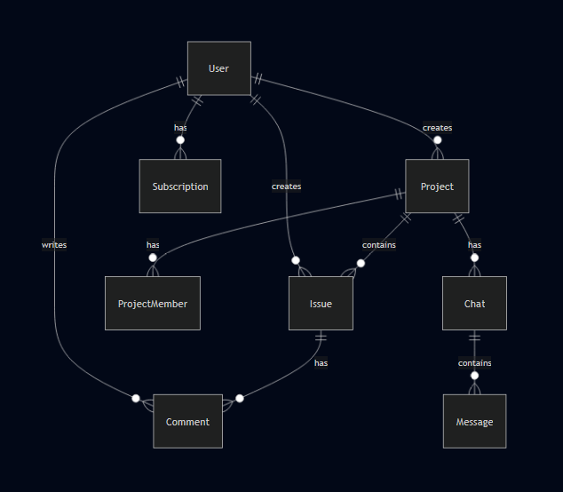

# Project Management System - Database Design Documentation

## Overview
This document provides a comprehensive overview of the database design for the Project Management System. The system implements a relational database structure to efficiently manage projects, issues, users, and their relationships.

## Entity Relationship Diagram



## Data Models

### User
- **id** (Primary Key)
- **username** (String)
- **email** (String, Unique)
- **password** (Hashed String)
- **created_at** (Timestamp)
- **updated_at** (Timestamp)

### Project
- **id** (Primary Key)
- **name** (String)
- **description** (Text)
- **category** (String)
- **tags** (Array)
- **creator_id** (Foreign Key → User)
- **created_at** (Timestamp)
- **updated_at** (Timestamp)

Relationships:
- Owner (Many-to-One with User)
- Team Members (Many-to-Many with User)
- Issues (One-to-Many)
- Chats (One-to-Many)

### Issue
- **id** (Primary Key)
- **title** (String)
- **description** (Text)
- **status** (String) [TODO, IN_PROGRESS, DONE]
- **priority** (String)
- **project_id** (Foreign Key → Project)
- **creator_id** (Foreign Key → User)
- **assignee_id** (Foreign Key → User)
- **created_at** (Timestamp)
- **updated_at** (Timestamp)

### Comment
- **id** (Primary Key)
- **content** (Text)
- **issue_id** (Foreign Key → Issue)
- **user_id** (Foreign Key → User)
- **created_at** (Timestamp)
- **updated_at** (Timestamp)

### Chat
- **id** (Primary Key)
- **project_id** (Foreign Key → Project)
- **created_at** (Timestamp)

### Subscription
- **id** (Primary Key)
- **user_id** (Foreign Key → User)
- **plan_type** (String) [FREE, PREMIUM]
- **status** (String) [ACTIVE, INACTIVE]
- **start_date** (Timestamp)
- **end_date** (Timestamp)

## Indexes

### Primary Indexes
- All id fields are primary indexes

### Secondary Indexes
1. User
   - email (unique index)

2. Project
   - creator_id
   - category
   - tags

3. Issue
   - project_id
   - creator_id
   - assignee_id
   - status

4. Comment
   - issue_id
   - user_id

5. Message
   - chat_id
   - sender_id

6. Subscription
   - user_id
   - status

## Constraints

### Unique Constraints
- User.email
- One active subscription per user

### Check Constraints
- Issue.status in ['TODO', 'IN_PROGRESS', 'DONE']
- ProjectMember.role in ['OWNER', 'MEMBER']
- Subscription.plan_type in ['FREE', 'PREMIUM']
- Subscription.status in ['ACTIVE', 'INACTIVE']

## Database Configuration

```properties
# Database Connection
spring.datasource.url=jdbc:oracle:thin:@//localhost:1521/xe
spring.datasource.username=system
spring.datasource.driver-class-name=oracle.jdbc.OracleDriver

# JPA/Hibernate
spring.jpa.hibernate.ddl-auto=validate
spring.jpa.show-sql=true
spring.jpa.properties.hibernate.format_sql=true

# Connection Pool
spring.datasource.hikari.maximum-pool-size=10
spring.datasource.hikari.minimum-idle=5
spring.datasource.hikari.idle-timeout=300000
```