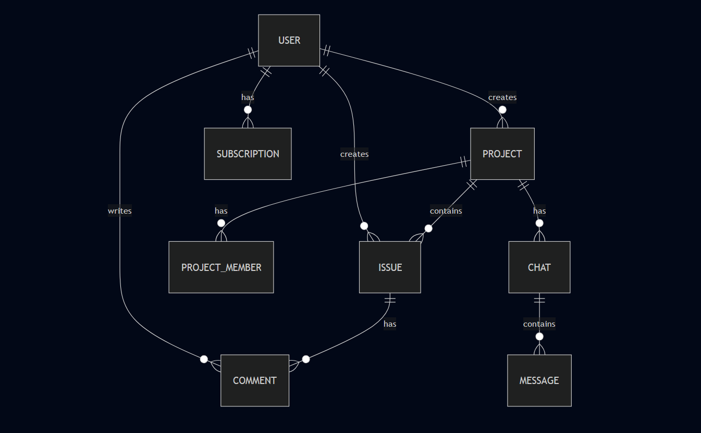

# Database Design Documentation

## Overview
This document outlines the database schema design for the Project Management System. The system uses a relational database structure to manage projects, issues, users, and their relationships.

## Entity Relationship Diagram

## Data Models

### User
- id (Primary Key)
- username (String)
- email (String, Unique)
- password (Hashed String)
- created_at (Timestamp)
- updated_at (Timestamp)

### Project
- id (Primary Key)
- name (String)
- description (Text)
- category (String)
- tags (Array)
- creator_id (Foreign Key -> User)
- created_at (Timestamp)
- updated_at (Timestamp)

### ProjectMember
- id (Primary Key)
- project_id (Foreign Key -> Project)
- user_id (Foreign Key -> User)
- role (String) [OWNER, MEMBER]
- joined_at (Timestamp)

### Issue
- id (Primary Key)
- title (String)
- description (Text)
- status (String) [TODO, IN_PROGRESS, DONE]
- priority (String)
- project_id (Foreign Key -> Project)
- creator_id (Foreign Key -> User)
- assignee_id (Foreign Key -> User)
- created_at (Timestamp)
- updated_at (Timestamp)

### Comment
- id (Primary Key)
- content (Text)
- issue_id (Foreign Key -> Issue)
- user_id (Foreign Key -> User)
- created_at (Timestamp)
- updated_at (Timestamp)

### Chat
- id (Primary Key)
- project_id (Foreign Key -> Project)
- created_at (Timestamp)

### Message
- id (Primary Key)
- content (Text)
- chat_id (Foreign Key -> Chat)
- sender_id (Foreign Key -> User)
- created_at (Timestamp)

### Subscription
- id (Primary Key)
- user_id (Foreign Key -> User)
- plan_type (String) [FREE, PREMIUM]
- status (String) [ACTIVE, INACTIVE]
- start_date (Timestamp)
- end_date (Timestamp)

## Indexes

### Primary Indexes
- All id fields are primary indexes

### Secondary Indexes
1. User
   - email (unique index)

2. Project
   - creator_id
   - category
   - tags

3. Issue
   - project_id
   - creator_id
   - assignee_id
   - status

4. Comment
   - issue_id
   - user_id

5. Message
   - chat_id
   - sender_id

6. Subscription
   - user_id (unique index)

## Constraints

### Foreign Key Constraints
- ProjectMember.project_id -> Project.id
- ProjectMember.user_id -> User.id
- Issue.project_id -> Project.id
- Issue.creator_id -> User.id
- Issue.assignee_id -> User.id
- Comment.issue_id -> Issue.id
- Comment.user_id -> User.id
- Chat.project_id -> Project.id
- Message.chat_id -> Chat.id
- Message.sender_id -> User.id
- Subscription.user_id -> User.id

### Unique Constraints
- User.email
- One active subscription per user

### Check Constraints
- Issue.status in ['TODO', 'IN_PROGRESS', 'DONE']
- ProjectMember.role in ['OWNER', 'MEMBER']
- Subscription.plan_type in ['FREE', 'PREMIUM']
- Subscription.status in ['ACTIVE', 'INACTIVE']