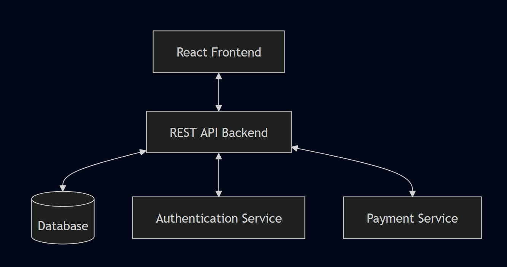
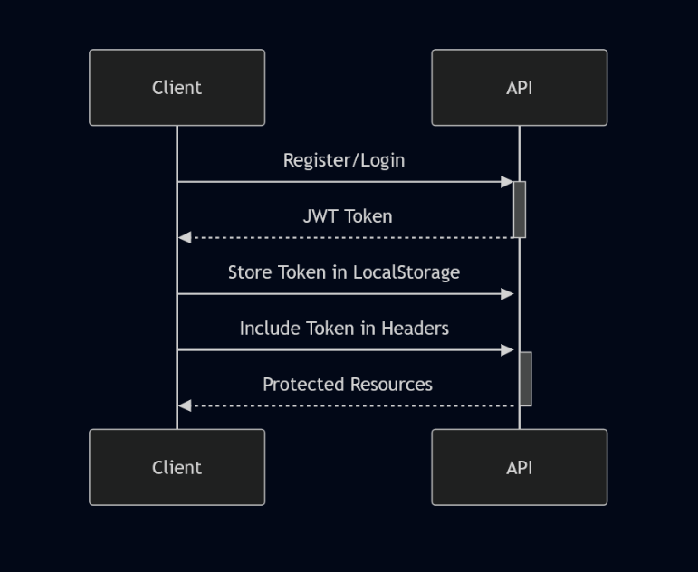

# System Design Documentation

## System Architecture

### Overview
The Project Management System is built using a modern web application architecture with the following key components:



## Frontend Architecture

### Technology Stack
- **Framework**: React + Vite
- **State Management**: Redux + Redux Thunk
- **UI Components**: shadcn/ui + Tailwind CSS
- **HTTP Client**: Axios
- **Routing**: React Router

### Component Structure
```
src/
├── components/     # Reusable UI components
├── pages/          # Route components
├── Redux/          # State management
├── config/         # Configuration
└── ProjectDetails/ # Project-specific components
```

### State Management
Redux store is organized into the following slices:
- **Auth**: User authentication and session management
- **Project**: Project CRUD operations
- **Issue**: Issue tracking and management
- **Comment**: Issue comments
- **Chat**: Real-time communication
- **Subscription**: Subscription management

## Backend Services

### API Endpoints

#### Authentication
- POST `/auth/signup`: User registration
- POST `/auth/login`: User authentication
- GET `/auth/user`: Get user details

#### Projects
- GET `/api/projects`: List projects
- POST `/api/projects`: Create project
- GET `/api/projects/{id}`: Get project details
- DELETE `/api/projects/{id}`: Delete project
- POST `/api/projects/{id}/invite`: Invite user to project

#### Issues
- GET `/api/issues/project/{id}`: List project issues
- POST `/api/issues`: Create issue
- GET `/api/issues/{id}`: Get issue details
- PATCH `/api/issues/{id}`: Update issue status
- POST `/api/issues/{id}/assign`: Assign issue to user

#### Comments
- GET `/api/comments/issue/{id}`: Get issue comments
- POST `/api/comments`: Create comment

#### Chat
- GET `/api/projects/{id}/chat`: Get project chat
- POST `/api/messages/send`: Send chat message

#### Subscription
- GET `/api/subscriptions/user`: Get user subscription
- PATCH `/api/subscriptions/upgrade`: Upgrade subscription

#### Payment
- POST `/api/payment/{planType}`: Create payment session

## Authentication Flow



## Key Features

### Project Management
1. **Project Creation**
   - Create new projects
   - Set project details and category
   - Add project tags

2. **Team Collaboration**
   - Invite team members
   - Real-time chat
   - Comment on issues

3. **Issue Tracking**
   - Create and assign issues
   - Update issue status
   - Comment on issues
   - Track issue history

### Subscription System
1. **Plan Management**
   - Free tier
   - Premium tier
   - Plan upgrade workflow

2. **Payment Integration**
   - Secure payment processing
   - Subscription status tracking

## Security Measures

1. **Authentication**
   - JWT-based authentication
   - Token expiration and refresh
   - Protected API routes

2. **Authorization**
   - Role-based access control
   - Project-level permissions
   - Resource ownership validation

## Error Handling

1. **Frontend**
   - Redux error states
   - User-friendly error messages
   - Loading states for async operations

2. **Backend**
   - Standardized error responses
   - Input validation
   - Error logging

## Performance Optimization

1. **Frontend**
   - Code splitting
   - Lazy loading
   - Optimized Redux selectors

2. **API**
   - Request caching
   - Rate limiting
   - Pagination

## Scalability Considerations

1. **Frontend**
   - Component reusability
   - Modular architecture
   - State management optimization

2. **Backend**
   - Microservices architecture
   - Load balancing
   - Database optimization

## Development Workflow

1. **Version Control**
   - Git-based workflow
   - Feature branching
   - Pull request reviews

2. **Code Quality**
   - ESLint configuration
   - Prettier formatting
   - Component-driven development

## Future Enhancements

1. **Features**
   - Advanced analytics
   - Time tracking
   - Document management
   - Integration with external tools

2. **Technical**
   - Real-time updates using WebSocket
   - Enhanced search functionality
   - Mobile application
   - Offline support