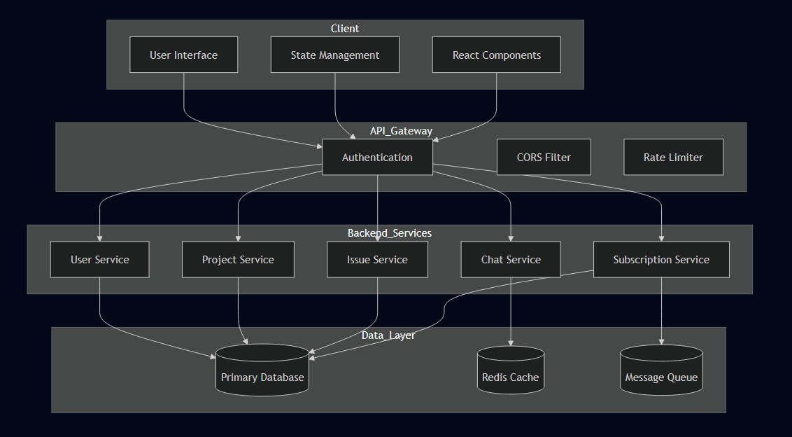
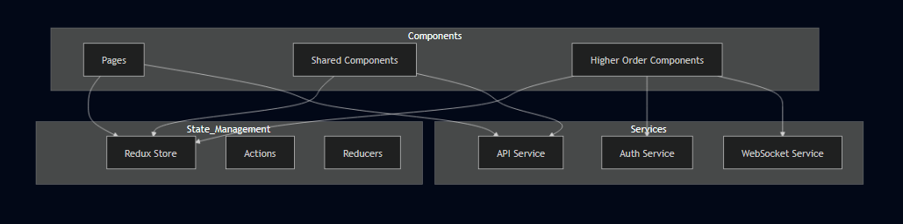
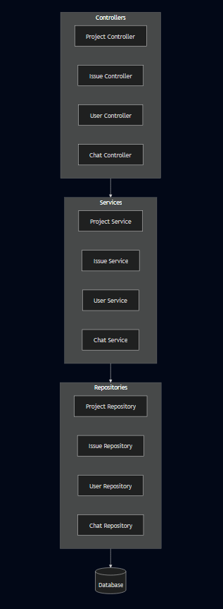
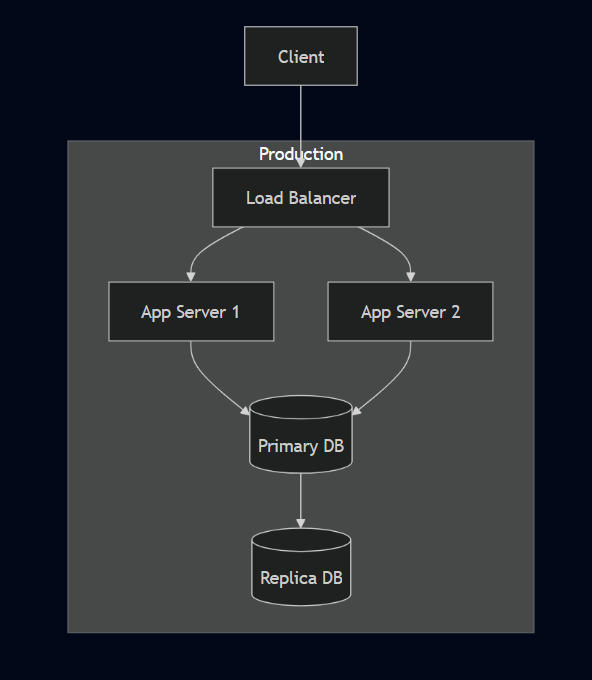

# Project Management System - System Design Documentation

## System Architecture Overview

## Component Architecture

### Frontend Architecture

### Backend Architecture

## Key Features

### Authentication System
1. **JWT-based Authentication**
   - Token generation and validation
   - Refresh token mechanism
   - Role-based access control

### Project Management
1. **Project Operations**
   - CRUD operations
   - Team management
   - Access control

2. **Issue Tracking**
   - Issue creation and assignment
   - Status tracking
   - Priority management

### Real-time Features
1. **Chat System**
   - Project-based chat rooms
   - Real-time messaging
   - Message history

2. **Notifications**
   - Real-time updates
   - Email notifications
   - In-app notifications

### Subscription System
1. **Plan Management**
   - Free tier
   - Premium tier
   - Plan upgrade workflow

2. **Payment Integration**
   - Secure payment processing
   - Subscription status tracking

## Security Measures

1. **Authentication & Authorization**
   - JWT token validation
   - Role-based access control
   - Session management

2. **Data Security**
   - Password hashing
   - Data encryption
   - HTTPS enforcement

3. **API Security**
   - Rate limiting
   - CORS configuration
   - Input validation

## Performance Optimization

1. **Caching Strategy**
   - Redis caching
   - Browser caching
   - Query optimization

2. **Load Balancing**
   - Request distribution
   - Server scaling
   - Traffic management

## Scalability Considerations

1. **Frontend**
   - Component reusability
   - Modular architecture
   - State management optimization

2. **Backend**
   - Microservices architecture
   - Load balancing
   - Database optimization

## Monitoring and Logging

1. **Application Monitoring**
   - Performance metrics
   - Error tracking
   - User analytics

2. **System Logging**
   - Activity logs
   - Error logs
   - Audit trails

## Deployment Architecture

## Development Workflow

1. **Version Control**
   - Git branching strategy
   - Code review process
   - Merge procedures

2. **CI/CD Pipeline**
   - Automated testing
   - Build automation
   - Deployment automation

3. **Environment Management**
   - Development
   - Staging
   - Production